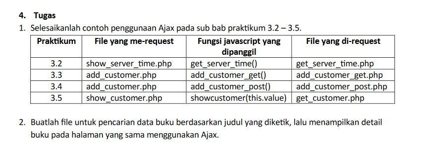

# Praktikum PBP D2 ke-3

Buatlah form seperti gambar berikut:




Yang dikumpulkan:
- get_server_time.php
- show_server_time.php
- add_customer_get.php
- add_customer_post.php 
- add_customer.php
- show_customers.php
- get_customer.php
- ajax.js
- get_books.php | untuk tugas 2
- search_book.php | untuk tugas 2


dan file dependency yang dibutuhkan (images, lib/db_login.php, header dan footer)

untuk db_login.php silahkan diganti dengan ini sebelum dikumpulkan:

```
$db_host = 'pbp.shariyl.cloud:3306';
$db_database = 'bookorama_shared';
$db_username = 'praktikum_03';
$db_password = 'password apaaan ini';
```

ini memang tidak secure naro disini, but whatever